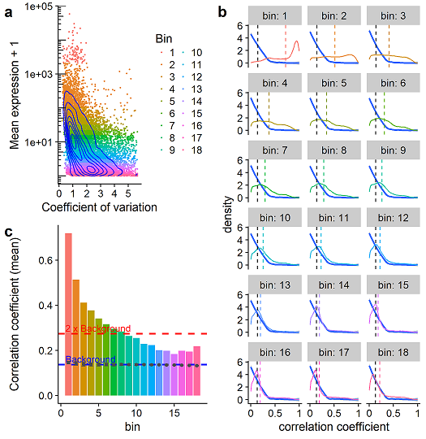

# scFeatureFilter
by Angeles Arzalluz-Luque, Guillaume Devailly, Anna Mantsoki, Anagha Joshi




An R package to set thresholds for feature (gene, transcript, ...) selection in single cell RNA sequencing analyses.

# How to install?
You can install the development version of scFeatureFilter using `devtools` (Require R version ≥ 3.4.2):
```R
devtools::install_github("gdevailly/scFeatureFilter")
```

# Getting started
Load the package:
```R
library(scFeatureFilter)
```

Then it is probably a good idea to read the package vignette:
```R
vignette("Introduction", package = "scFeatureFilter")
```
